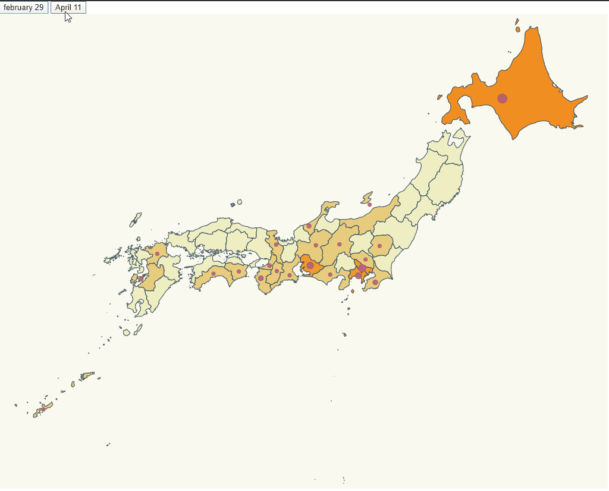

# Rendering map

The objective is using the mandatory task to change the colour of each community in function of the number of cases of covid



those prefectures with 0 cases of covid19 does not have circle, this is the case of some prefectures on February 29 and they have circle on April 11. On April 11 date Iwate prefecture is the last prefecture with 0 cases of covid19

# Steps

- We will take as starting example The advanced task that is in https://github.com/alvaroflorin/Advanced-d3js

_./src/japan.json_

Spain.json was deleted and instead of it japan.json was used from https://cdn.rawgit.com/rveciana/5919944/raw/a3d0f29d851893e15dcf6194997453086c408fd3/japan.json, after that all prefectures were in the map but all of them used the region name all region names were changed to the prefecture name and the name is the same the it will be in prefectures.ts and stats.ts

_./src/stats.ts_

It was completly changed to the data of japan at the dates february 29 as initial (data in https://en.wikipedia.org/wiki/Template:2019%E2%80%9320_coronavirus_pandemic_data/Japan_medical_cases) and april 11 (data in https://www.nippon.com/en/japan-data/h00657/coronavirus-cases-in-japan-by-prefecture.html) as current conserving only ResultEntry interface

_./src/prefectures.ts_

Communities.ts was deleted and instead of it prefectures was created that contains all latitude and longitude of japanese prefectures

_./src/index.html_

Buttons were renamed to the date of the data that load
```diff
    <div>
+   <button id="initial">february 29</button>
-   <button id="initial">Initial cases</button>
-   <button id="current">Current cases</button>
+   <button id="current">April 11</button>
    </div>
```
_./src/map.css_

Community class was changed to prefecture
```diff
+.prefecture {
-.community {
  stroke-width: 1;
  stroke: #2f4858;
}
```

_./src/index.ts_

Imports were changed
```diff
 import * as d3 from "d3";
 import * as topojson from "topojson-client";
-const spainjson = require("./spain.json");
+const japanjson = require("./japan.json");
 import { stats, statsUpdated, ResultEntry } from "./stats";
 const d3Composite = require("d3-composite-projections");
+import { latLongCommunities } from "./prefectures";
-import { latLongCommunities } from "./communities";
```

_./src/index.ts_

In the var colour the range was adapted to japan data and one colour was changed because it was difficult to se differences between it an other colours
```diff
var colour = d3
    .scaleThreshold<number, string>()
-   .domain([0,15,50,100,1000,5000,10000,40000])
+   .domain([0,1,20,50,100,400,800,1900])
    .range([
+   "#eeeeee",
    "#eeeec3",
    "#e8cd7e",
-   "#eda63f",
    "#ef9b30",
    "#f18e22",
    "#f48114",
    "#f67304",
    "#fb5000",
    "#ff0000"
  ]); 
```
_./src/index.ts_

The fill of the communities colour was changed by che change of map.css and the new japan.json instead of spain.json
```diff
svg
    .selectAll("path")
    .data(geojson["features"])
    .enter()
    .append("path")
-   .attr("class", "community")
+   .attr("class", "prefecture")
-   .attr("fill",d=>assignRegionBackgroundColor(d["properties"]["NAME_1"]))
+    .attr("fill",d=>assignRegionBackgroundColor(d["properties"]["region"]))
    .attr("d", geoPath as any)
    .merge(svg.selectAll("path") as any)
    .transition()
    .duration(500)
-   .attr("fill",d=>assignRegionBackgroundColor(d["properties"]["NAME_1"]))
+    .attr("fill",d=>assignRegionBackgroundColor(d["properties"]["region"]))
    ;
```
_./src/index.ts_

aProjection was changed to center the map of Japan on the screen
```diff
-const aProjection = d3Composite
-  .geoConicConformalSpain()
-  .scale(3300)
-  .translate([500, 400]);
+const aProjection = d3.geoMercator()
+  .precision(0.1)
+  .center([138, 35])
+  .rotate([0,0,20])
+  .scale(1800)
+  .translate([100 , 920 ]);
const geoPath = d3.geoPath().projection(aProjection);
-const geojson = topojson.feature(spainjson, spainjson.objects.ESP_adm1);
+const geojson = topojson.feature(japanjson, japanjson.objects.japan);
```

_./src/index.ts_

The radius calcule was adapted to japanese data
```diff
  const affectedRadiusScaleQuantile=d3
  .scaleLinear()
-  .domain([0,15,50,100,1000,5000,10000,40000])
-  .range([5,9,12,15,18,21,25,30,40])
+  .domain([0,1,20,50,100,400,800,1900])
+  .range([0,9,12,15,18,21,25,30,40])
```

```


