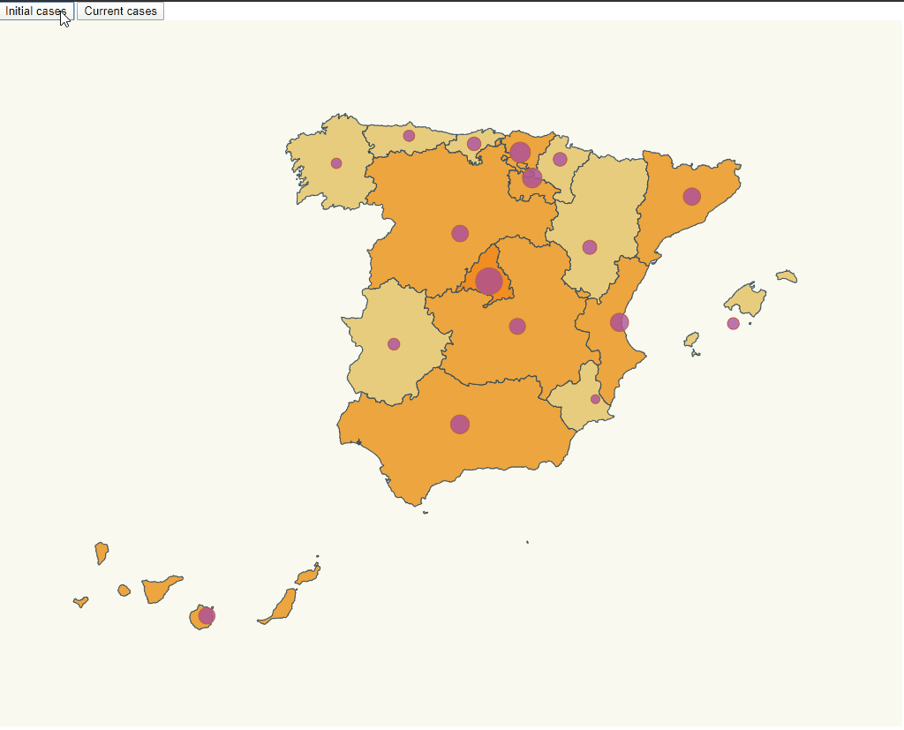

# Rendering map

The objective is using the mandatory task to change the colour of each community in function of the number of cases of covid




# Steps

- We will take as starting example The mandatory task that is in https://github.com/alvaroflorin/Mandatory-d3js

_./src/index.ts_

A function named colour was added to set the colours for a domain, that allow to choose the colour given a number of cases
```diff
+var colour = d3
+  .scaleThreshold<number, string>()
+  .domain([0,15,50,100,1000,5000,10000,40000])
+  .range([
+    "#eeeec3;",
+    "#e8cd7e",
+    "#eda63f",
+    "#ef9b30",
+    "#f18e22",
+    "#f48114",
+    "#f67304",
+    "#fb5000",
+    "#ff0000"
+  ]); 
```
_./src/index.ts_

The fill of the communities colour was changed and now is in createSvg() const

```diff
svg
    .selectAll("path")
    .data(geojson["features"])
    .enter()
    .append("path")
    .attr("class", "community")
+   .attr("fill",d=>assignRegionBackgroundColor(d["properties"]["NAME_1"]))
    .attr("d", geoPath as any)
+   .merge(svg.selectAll("path") as any)
+   .transition()
+   .duration(500)
+   .attr("fill",d=>assignRegionBackgroundColor(d["properties"]["NAME_1"]))
    ;
```
_./src/index.ts_

a const that with the name of the community find the number of cases and return the colour var of that amount of cases was added

```diff
+ const assignRegionBackgroundColor = (name: string) => {
+    const item = data.find(
+      item => item.name === name
+    ); 
+    if (item) {
+      console.log(item.value);
+    }
+    return item ? colour(item.value) : colour(0);
+  };
```

